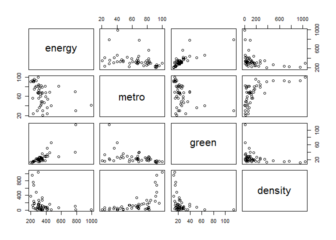

R Notebook
================

This is an [R Markdown](http://rmarkdown.rstudio.com) Notebook. When you execute code within the notebook, the results appear beneath the code.

Try executing this chunk by clicking the *Run* button within the chunk or by placing your cursor inside it and pressing *Ctrl+Shift+Enter*.

``` r
states.data <- readRDS("C:/Users/John/Documents/R/ml lessons in springboard/linear_regression/dataSets/states.rds")

#get labels
states.info <- data.frame(attributes(states.data)[c("names", "var.labels")])
#look at last few labels
tail(states.info, 8)
```

    ##      names                      var.labels
    ## 14    csat        Mean composite SAT score
    ## 15    vsat           Mean verbal SAT score
    ## 16    msat             Mean math SAT score
    ## 17 percent       % HS graduates taking SAT
    ## 18 expense Per pupil expenditures prim&sec
    ## 19  income Median household income, $1,000
    ## 20    high             % adults HS diploma
    ## 21 college         % adults college degree

``` r
sts.ex.sat <- subset(states.data, select = c("expense", "csat"))
summary(sts.ex.sat)
```

    ##     expense          csat       
    ##  Min.   :2960   Min.   : 832.0  
    ##  1st Qu.:4352   1st Qu.: 888.0  
    ##  Median :5000   Median : 926.0  
    ##  Mean   :5236   Mean   : 944.1  
    ##  3rd Qu.:5794   3rd Qu.: 997.0  
    ##  Max.   :9259   Max.   :1093.0

``` r
# correlation between expense and csat
cor(sts.ex.sat)
```

    ##            expense       csat
    ## expense  1.0000000 -0.4662978
    ## csat    -0.4662978  1.0000000

``` r
# scatter plot of expense vs csat
plot(sts.ex.sat)
```


``` r
# Fit our regression model
sat.mod <- lm(csat ~ expense, # regression formula
              data=states.data) # data set
# Summarize and print the results
summary(sat.mod) # show regression coefficients table
```

    ## 
    ## Call:
    ## lm(formula = csat ~ expense, data = states.data)
    ## 
    ## Residuals:
    ##      Min       1Q   Median       3Q      Max 
    ## -131.811  -38.085    5.607   37.852  136.495 
    ## 
    ## Coefficients:
    ##               Estimate Std. Error t value Pr(>|t|)    
    ## (Intercept)  1.061e+03  3.270e+01   32.44  < 2e-16 ***
    ## expense     -2.228e-02  6.037e-03   -3.69 0.000563 ***
    ## ---
    ## Signif. codes:  0 '***' 0.001 '**' 0.01 '*' 0.05 '.' 0.1 ' ' 1
    ## 
    ## Residual standard error: 59.81 on 49 degrees of freedom
    ## Multiple R-squared:  0.2174, Adjusted R-squared:  0.2015 
    ## F-statistic: 13.61 on 1 and 49 DF,  p-value: 0.0005631

``` r
# summary of expense and csat columns, all rows
sts.ex.sat <- subset(states.data, select = c("expense", "csat"))
summary(sts.ex.sat)
```

    ##     expense          csat       
    ##  Min.   :2960   Min.   : 832.0  
    ##  1st Qu.:4352   1st Qu.: 888.0  
    ##  Median :5000   Median : 926.0  
    ##  Mean   :5236   Mean   : 944.1  
    ##  3rd Qu.:5794   3rd Qu.: 997.0  
    ##  Max.   :9259   Max.   :1093.0

``` r
# correlation between expense and csat
cor(sts.ex.sat)
```

    ##            expense       csat
    ## expense  1.0000000 -0.4662978
    ## csat    -0.4662978  1.0000000

``` r
##   Plot the data to look for multivariate outliers, non-linear
##   relationships etc.

# scatter plot of expense vs csat
plot(sts.ex.sat)
```


``` r
##   • Linear regression models can be fit with the `lm()' function
##   • For example, we can use `lm' to predict SAT scores based on
##     per-pupal expenditures:

# Fit our regression model
sat.mod <- lm(csat ~ expense, # regression formula
              data=states.data) # data set
# Summarize and print the results
summary(sat.mod) # show regression coefficients table
```

    ## 
    ## Call:
    ## lm(formula = csat ~ expense, data = states.data)
    ## 
    ## Residuals:
    ##      Min       1Q   Median       3Q      Max 
    ## -131.811  -38.085    5.607   37.852  136.495 
    ## 
    ## Coefficients:
    ##               Estimate Std. Error t value Pr(>|t|)    
    ## (Intercept)  1.061e+03  3.270e+01   32.44  < 2e-16 ***
    ## expense     -2.228e-02  6.037e-03   -3.69 0.000563 ***
    ## ---
    ## Signif. codes:  0 '***' 0.001 '**' 0.01 '*' 0.05 '.' 0.1 ' ' 1
    ## 
    ## Residual standard error: 59.81 on 49 degrees of freedom
    ## Multiple R-squared:  0.2174, Adjusted R-squared:  0.2015 
    ## F-statistic: 13.61 on 1 and 49 DF,  p-value: 0.0005631

``` r
summary(lm(csat ~ expense + percent, data = states.data))
```

    ## 
    ## Call:
    ## lm(formula = csat ~ expense + percent, data = states.data)
    ## 
    ## Residuals:
    ##     Min      1Q  Median      3Q     Max 
    ## -62.921 -24.318   1.741  15.502  75.623 
    ## 
    ## Coefficients:
    ##               Estimate Std. Error t value Pr(>|t|)    
    ## (Intercept) 989.807403  18.395770  53.806  < 2e-16 ***
    ## expense       0.008604   0.004204   2.046   0.0462 *  
    ## percent      -2.537700   0.224912 -11.283 4.21e-15 ***
    ## ---
    ## Signif. codes:  0 '***' 0.001 '**' 0.01 '*' 0.05 '.' 0.1 ' ' 1
    ## 
    ## Residual standard error: 31.62 on 48 degrees of freedom
    ## Multiple R-squared:  0.7857, Adjusted R-squared:  0.7768 
    ## F-statistic: 88.01 on 2 and 48 DF,  p-value: < 2.2e-16

``` r
##   Many people find it surprising that the per-capita expenditure on
##   students is negatively related to SAT scores. The beauty of multiple
##   regression is that we can try to pull these apart. What would the
##   association between expense and SAT scores be if there were no
##   difference among the states in the percentage of students taking the
##   SAT?

summary(lm(csat ~ expense + percent, data = states.data))
```

    ## 
    ## Call:
    ## lm(formula = csat ~ expense + percent, data = states.data)
    ## 
    ## Residuals:
    ##     Min      1Q  Median      3Q     Max 
    ## -62.921 -24.318   1.741  15.502  75.623 
    ## 
    ## Coefficients:
    ##               Estimate Std. Error t value Pr(>|t|)    
    ## (Intercept) 989.807403  18.395770  53.806  < 2e-16 ***
    ## expense       0.008604   0.004204   2.046   0.0462 *  
    ## percent      -2.537700   0.224912 -11.283 4.21e-15 ***
    ## ---
    ## Signif. codes:  0 '***' 0.001 '**' 0.01 '*' 0.05 '.' 0.1 ' ' 1
    ## 
    ## Residual standard error: 31.62 on 48 degrees of freedom
    ## Multiple R-squared:  0.7857, Adjusted R-squared:  0.7768 
    ## F-statistic: 88.01 on 2 and 48 DF,  p-value: < 2.2e-16

``` r
confint(sat.mod)
```

    ##                    2.5 %        97.5 %
    ## (Intercept) 995.01753164 1126.44735626
    ## expense      -0.03440768   -0.01014361

``` r
hist(residuals(sat.mod))
```


``` r
##   • Ordinary least squares regression relies on several assumptions,
##     including that the residuals are normally distributed and
##     homoscedastic, the errors are independent and the relationships are
##     linear.

##   • Investigate these assumptions visually by plotting your model:

par(mar = c(4, 4, 2, 2), mfrow = c(1, 2)) #optional
plot(sat.mod, which = c(1, 2)) # "which" argument optional
```


``` r
##   Do congressional voting patterns predict SAT scores over and above
##   expense? Fit two models and compare them:

# fit another model, adding house and senate as predictors
sat.voting.mod <-  lm(csat ~ expense + house + senate,
                      data = na.omit(states.data))
sat.mod <- update(sat.mod, data=na.omit(states.data))

# compare using the anova() function
anova(sat.mod, sat.voting.mod)
```

    ## Analysis of Variance Table
    ## 
    ## Model 1: csat ~ expense
    ## Model 2: csat ~ expense + house + senate
    ##   Res.Df    RSS Df Sum of Sq      F  Pr(>F)  
    ## 1     46 169050                              
    ## 2     44 149284  2     19766 2.9128 0.06486 .
    ## ---
    ## Signif. codes:  0 '***' 0.001 '**' 0.01 '*' 0.05 '.' 0.1 ' ' 1

``` r
coef(summary(sat.voting.mod))
```

    ##                  Estimate   Std. Error    t value     Pr(>|t|)
    ## (Intercept) 1082.93438041 38.633812740 28.0307405 1.067795e-29
    ## expense       -0.01870832  0.009691494 -1.9303852 6.001998e-02
    ## house         -1.44243754  0.600478382 -2.4021473 2.058666e-02
    ## senate         0.49817861  0.513561356  0.9700469 3.373256e-01

Exercise: least squares regression
----------------------------------

────────────────────────────────────────
----------------------------------------

Use the /states.rds/ data set. Fit a model predicting energy consumed
---------------------------------------------------------------------

per capita (energy) from the percentage of residents living in
--------------------------------------------------------------

metropolitan areas (metro). Be sure to
--------------------------------------

1. Examine/plot the data before fitting the model
-------------------------------------------------

2. Print and interpret the model `summary' ##   3.`plot' the model to look for deviations from modeling assumptions
-------------------------------------------------------------------------------------------------------------------

Select one or more additional predictors to add to your model and
-----------------------------------------------------------------

repeat steps 1-3. Is this model significantly better than the model
-------------------------------------------------------------------

with /metro/ as the only predictor?
-----------------------------------

``` r
sts.eng.met <- subset(states.data, select = c("energy", "metro"))

plot(sts.eng.met)
```


``` r
states.info1<- lm(energy~ metro, data = states.data)

summary(states.info1)
```

    ## 
    ## Call:
    ## lm(formula = energy ~ metro, data = states.data)
    ## 
    ## Residuals:
    ##     Min      1Q  Median      3Q     Max 
    ## -215.51  -64.54  -30.87   18.71  583.97 
    ## 
    ## Coefficients:
    ##             Estimate Std. Error t value Pr(>|t|)    
    ## (Intercept) 501.0292    61.8136   8.105 1.53e-10 ***
    ## metro        -2.2871     0.9139  -2.503   0.0158 *  
    ## ---
    ## Signif. codes:  0 '***' 0.001 '**' 0.01 '*' 0.05 '.' 0.1 ' ' 1
    ## 
    ## Residual standard error: 140.2 on 48 degrees of freedom
    ##   (1 observation deleted due to missingness)
    ## Multiple R-squared:  0.1154, Adjusted R-squared:  0.097 
    ## F-statistic: 6.263 on 1 and 48 DF,  p-value: 0.01578

``` r
sts.eng.met.gre.des<-subset(states.data,select = c("energy","metro",
                            "green","density"))
plot(sts.eng.met.gre.des)
```



``` r
states.info2<-lm(energy~metro+green+density,data=states.data)
summary(states.info2)
```

    ## 
    ## Call:
    ## lm(formula = energy ~ metro + green + density, data = states.data)
    ## 
    ## Residuals:
    ##    Min     1Q Median     3Q    Max 
    ## -93.14 -42.25 -13.45  21.59 354.38 
    ## 
    ## Coefficients:
    ##              Estimate Std. Error t value Pr(>|t|)    
    ## (Intercept) 187.19154   48.40117   3.868 0.000359 ***
    ## metro         0.54741    0.64924   0.843 0.403702    
    ## green         5.39192    0.73233   7.363 3.37e-09 ***
    ## density      -0.08401    0.05742  -1.463 0.150539    
    ## ---
    ## Signif. codes:  0 '***' 0.001 '**' 0.01 '*' 0.05 '.' 0.1 ' ' 1
    ## 
    ## Residual standard error: 75.22 on 44 degrees of freedom
    ##   (3 observations deleted due to missingness)
    ## Multiple R-squared:  0.6127, Adjusted R-squared:  0.5863 
    ## F-statistic:  23.2 on 3 and 44 DF,  p-value: 3.688e-09

The model was significantly different when adding green as a predictor, the r- squared and Adjusted R-squared increased dramatically.

Interactions and factors
------------------------

══════════════════════════
--------------------------

Modeling interactions
---------------------

─────────────────────────
-------------------------

Interactions allow us assess the extent to which the association
----------------------------------------------------------------

between one predictor and the outcome depends on a second predictor.
--------------------------------------------------------------------

For example: Does the association between expense and SAT scores
----------------------------------------------------------------

depend on the median income in the state?
-----------------------------------------

\#Add the interaction to the model sat.expense.by.percent &lt;- lm(csat ~ expense\*income, data=states.data) \#Show the results coef(summary(sat.expense.by.percent)) \# show regression coefficients table

Regression with categorical predictors
--------------------------------------

──────────────────────────────────────────
------------------------------------------

Let's try to predict SAT scores from region, a categorical variable.
--------------------------------------------------------------------

Note that you must make sure R does not think your categorical
--------------------------------------------------------------

variable is numeric.
--------------------

make sure R knows region is categorical
=======================================

str(states.data*r**e**g**i**o**n*)*s**t**a**t**e**s*.*d**a**t**a*region &lt;- factor(states.data$region) \#Add region to the model sat.region &lt;- lm(csat ~ region, data=states.data) \#Show the results coef(summary(sat.region)) \# show regression coefficients table anova(sat.region) \# show ANOVA table

Again, *make sure to tell R which variables are categorical by \#\# converting them to factors!*
------------------------------------------------------------------------------------------------

Setting factor reference groups and contrasts
---------------------------------------------

─────────────────────────────────────────────────
-------------------------------------------------

In the previous example we use the default contrasts for region. The
--------------------------------------------------------------------

default in R is treatment contrasts, with the first level as the
----------------------------------------------------------------

reference. We can change the reference group or use another coding
------------------------------------------------------------------

scheme using the \`C' function.
-------------------------------

print default contrasts
=======================

contrasts(states.data$region) \# change the reference group coef(summary(lm(csat ~ C(region, base=4), data=states.data))) \# change the coding scheme coef(summary(lm(csat ~ C(region, contr.helmert), data=states.data)))

See also `?contrasts',`?contr.treatment', and \`?relevel'.
----------------------------------------------------------

``` r
 #Add the interaction to the model
sat.expense.by.percent <- lm(csat ~ expense*income,
                             data=states.data) 
 coef(summary(sat.expense.by.percent)) # show regression coefficients table
```

    ##                     Estimate   Std. Error   t value     Pr(>|t|)
    ## (Intercept)     1.380364e+03 1.720863e+02  8.021351 2.367069e-10
    ## expense        -6.384067e-02 3.270087e-02 -1.952262 5.687837e-02
    ## income         -1.049785e+01 4.991463e+00 -2.103161 4.083253e-02
    ## expense:income  1.384647e-03 8.635529e-04  1.603431 1.155395e-01

``` r
# make sure R knows region is categorical
str(states.data$region)
```

    ##  Factor w/ 4 levels "West","N. East",..: 3 1 1 3 1 1 2 3 NA 3 ...

``` r
states.data$region <- factor(states.data$region)

#Add region to the model
sat.region <- lm(csat ~ region,
                 data=states.data) 

#Show the results
coef(summary(sat.region)) # show regression coefficients table
```

    ##                Estimate Std. Error    t value     Pr(>|t|)
    ## (Intercept)   946.30769   14.79582 63.9577807 1.352577e-46
    ## regionN. East -56.75214   23.13285 -2.4533141 1.800383e-02
    ## regionSouth   -16.30769   19.91948 -0.8186806 4.171898e-01
    ## regionMidwest  63.77564   21.35592  2.9863209 4.514152e-03

``` r
anova(sat.region) # show ANOVA table
```

    ## Analysis of Variance Table
    ## 
    ## Response: csat
    ##           Df Sum Sq Mean Sq F value    Pr(>F)    
    ## region     3  82049 27349.8  9.6102 4.859e-05 ***
    ## Residuals 46 130912  2845.9                      
    ## ---
    ## Signif. codes:  0 '***' 0.001 '**' 0.01 '*' 0.05 '.' 0.1 ' ' 1

``` r
# print default contrasts
contrasts(states.data$region)
```

    ##         N. East South Midwest
    ## West          0     0       0
    ## N. East       1     0       0
    ## South         0     1       0
    ## Midwest       0     0       1

``` r
# change the reference group
coef(summary(lm(csat ~ C(region, base=4),
                data=states.data)))
```

    ##                        Estimate Std. Error   t value     Pr(>|t|)
    ## (Intercept)          1010.08333   15.39998 65.589930 4.296307e-47
    ## C(region, base = 4)1  -63.77564   21.35592 -2.986321 4.514152e-03
    ## C(region, base = 4)2 -120.52778   23.52385 -5.123641 5.798399e-06
    ## C(region, base = 4)3  -80.08333   20.37225 -3.931000 2.826007e-04

``` r
# change the coding scheme
coef(summary(lm(csat ~ C(region, contr.helmert),
                data=states.data)))
```

    ##                             Estimate Std. Error     t value     Pr(>|t|)
    ## (Intercept)               943.986645   7.706155 122.4977451 1.689670e-59
    ## C(region, contr.helmert)1 -28.376068  11.566423  -2.4533141 1.800383e-02
    ## C(region, contr.helmert)2   4.022792   5.884552   0.6836191 4.976450e-01
    ## C(region, contr.helmert)3  22.032229   4.446777   4.9546509 1.023364e-05

Exercise: interactions and factors
----------------------------------

────────────────────────────────────────
----------------------------------------

Use the states data set.
------------------------

1. Add on to the regression equation that you created in exercise 1 by
----------------------------------------------------------------------

generating an interaction term and testing the interaction.
-----------------------------------------------------------

2. Try adding region to the model. Are there significant differences
--------------------------------------------------------------------

across the four regions?
------------------------

``` r
states.info3<- lm(energy~ metro*college, data = states.data)

 coef(summary(states.info3)) # show regression coefficients table
```

    ##                  Estimate  Std. Error    t value  Pr(>|t|)
    ## (Intercept)   173.2208505 344.2305571  0.5032117 0.6172166
    ## metro           3.8667119   5.1269950  0.7541868 0.4545807
    ## college        15.9302000  17.7611168  0.8969143 0.3744349
    ## metro:college  -0.2929545   0.2503469 -1.1701941 0.2479500

``` r
# make sure R knows region is categorical
str(states.data$region)
```

    ##  Factor w/ 4 levels "West","N. East",..: 3 1 1 3 1 1 2 3 NA 3 ...

``` r
states.data$region <- factor(states.data$region)

#Add region to the model
met.region <- lm(energy
                 ~ region,
                 data=states.data)
#Show the results
coef(summary(met.region)) # show regression coefficients table
```

    ##                 Estimate Std. Error    t value     Pr(>|t|)
    ## (Intercept)    405.61538   39.23196 10.3389019 1.395176e-13
    ## regionN. East -156.50427   61.33807 -2.5515032 1.411486e-02
    ## regionSouth    -25.49038   52.81764 -0.4826112 6.316606e-01
    ## regionMidwest  -61.61538   56.62646 -1.0881024 2.822182e-01

``` r
anova(met.region) # show ANOVA table
```

    ## Analysis of Variance Table
    ## 
    ## Response: energy
    ##           Df Sum Sq Mean Sq F value  Pr(>F)  
    ## region     3 145757   48586  2.4282 0.07737 .
    ## Residuals 46 920410   20009                  
    ## ---
    ## Signif. codes:  0 '***' 0.001 '**' 0.01 '*' 0.05 '.' 0.1 ' ' 1

``` r
# print default contrasts
contrasts(states.data$region)
```

    ##         N. East South Midwest
    ## West          0     0       0
    ## N. East       1     0       0
    ## South         0     1       0
    ## Midwest       0     0       1

``` r
# change the reference group
coef(summary(lm(energy ~ C(region, base=4),
                data=states.data)))
```

    ##                       Estimate Std. Error    t value     Pr(>|t|)
    ## (Intercept)          344.00000   40.83392  8.4243691 7.058813e-11
    ## C(region, base = 4)1  61.61538   56.62646  1.0881024 2.822182e-01
    ## C(region, base = 4)2 -94.88889   62.37484 -1.5212686 1.350374e-01
    ## C(region, base = 4)3  36.12500   54.01820  0.6687561 5.069935e-01

``` r
# change the coding scheme
coef(summary(lm(energy ~ C(region, contr.helmert),
                data=states.data)))
```

    ##                              Estimate Std. Error     t value     Pr(>|t|)
    ## (Intercept)               344.7128739   20.43331 16.87014156 2.504367e-21
    ## C(region, contr.helmert)1 -78.2521368   30.66903 -2.55150316 1.411486e-02
    ## C(region, contr.helmert)2  17.5872507   15.60323  1.12715468 2.655225e-01
    ## C(region, contr.helmert)3  -0.2376246   11.79088 -0.02015325 9.840083e-01

The interaction of metro and college did increase the magnitude of the t-value, but not enough to show signifigance. With that interaction the region were not showing any significant differences.
